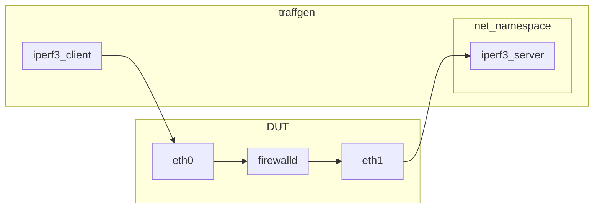

## Introduction

Firewalld gained support for [nftables
flowtable](https://github.com/firewalld/firewalld/pull/1116). This is a
software fastpath that may significantly improve forwarding performance.

[Nftables
flowtable](https://wiki.nftables.org/wiki-nftables/index.php/Flowtables)
makes use of the kernel's connection tracking to bypass much of the
network stack. This accelerates data packets of established
connections.

## What It Looks Like

This feature can be enabled by setting `NftablesFlowtable` in
`/etc/firewalld/firewalld.conf`. This setting defaults to `off`. To
enable flowtable support set this value to your list of interfaces for
which you want flowtable to be enabled, e.g. `NftablesFlowtable=eth0
eth1`.

This can be done manually or with a sed expression.

Example to enable `eth0` and `eth1`:

```
# sed -i 's/^NftablesFlowtable=.*/NftablesFlowtable=eth0 eth1/' /etc/firewalld/firewalld.conf
# firewall-cmd --reload
```

When this feature is enabled firewalld adds the below additional nftables
rules. It's one additional rule and one flowtable object.

```
table inet firewalld {
        flowtable fastpath {
                hook ingress priority filter + 10
                devices = { eth0, eth1 }
        }
[..]
	chain filter_FORWARD {
		type filter hook forward priority filter + 10; policy accept;
		ct state { established, related } meta l4proto { tcp, udp } flow add @fastpath  <--- new rule
		ct state { established, related } accept
[..]
```

## Performance Tests

This is the test topology used for gather performance test results.



The device under test was artificially limited to two CPU cores. This
was done specifically to stress the forward path.

The [traffic
generation](https://gist.github.com/erig0/aaef1ca59f285323dcacf66255244c60)
uses 16 iperf3 instances run in parallel with 128 parallel streams for
60 seconds. This simulates 2048 concurrent connections. The benchmark is
run 10 times to normalize the results and produce a standard deviation.

Below is a graph of the results of `NftablesFlowtable` disabled vs
enabled. The absolute numbers are less important. The important
takeaway is the relative performance improvement.


## More information

Nftables flowtable can accelerate TCP and UDP flows. Control packets
will still take the traditional network path, i.e. they will take the
slow path.

Firewalld supports source based zones with `--add-source`. These can
also be accelerated, but keep in mind that flowtable is enabled on the
interface. So you must make sure that traffic from that source is
received on the interface that was added to `NftablesFlowtable`. If in
doubt, always use `--add-interface`.

## Summary

Nftables flowtable brings a significant performance improvement for
forwarded traffic. This is applies to use cases like: network firewall,
home router, and even container/VM traffic.
