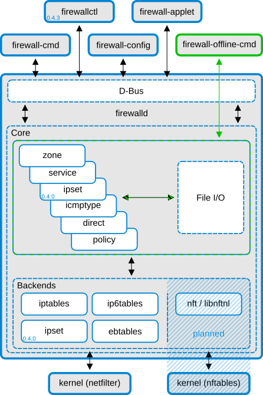

---
layout: page
title: "Architecture"
--- 

firewalld has a two layer design: The core layer and the D-Bus layer on top. The core layer is responsible for handling the configuration and the back ends like iptables, ip6tables, ebtables, ipset and the module loader.

*firewalld structure*

The firewalld D-Bus interface is the primary way to alter and create the firewall configuration. The interface is used by all firewalld provided online tools, like for example firewall-cmd, firewall-config and firewall-applet. firewall-offline-cmd is not talking to firewalld, but altering and creating firewalld configuration files directly using the firewalld core with the IO handlers. firewall-offline-cmd can be used while firewalld is running, but it is not recommended as it is only able to alter the permanent configuration that are visible in firewall after about five seconds.

More information on the firewalld D-Bus API is available [here](man-pages/firewalld.dbus.html).

firewalld does not depend on NetworkManager, but the use is recommended. If NetworkManager is not used, there are some limitations: firewalld will not get notified about network device renames. If firewalld gets started after the network is already up, the connections and manually created interfaces are not bound to a zone. You can add them to a zone with `firewall-cmd [--permanent] --zone=zone --add-interface=interface`, but make sure that if there's a `/etc/sysconfig/network-scripts/ifcfg-<interface>`, the zone specified there with `ZONE=zone` is the same (or both are empty/missing for default zone), otherwise the behaviour would be undefined.
