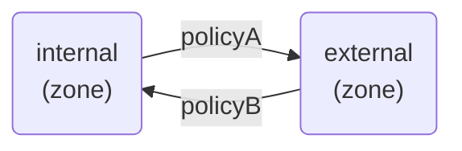
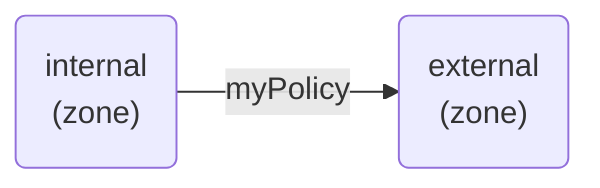
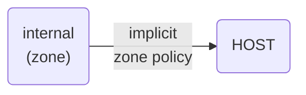

---
layout: page
title: "Concepts"
--- 

## Introduction

Firewalld is a simple, stateful, zone-based firewall. Policies and zones
are used to organize firewall rules. The network is logically divided
into zones and the traffic flowing between them can be governed by
policies.

This looks like the following:



Policies may apply firewall rules to all traffic types. This includes
filtering input, forwarded, and output traffic; as well as performing
network address translations (NAT).

## Zone Principles

Firewalld follows some strict principles in regards to zones.

1. traffic ingresses one and only one zone
2. traffic egresses one and only one zone
3. a zone defines a level of trust
4. intra-zone (within the same zone) is allowed by default
5. inter-zone (zone to zone) is denied by default

Principle 4 and 5 are actually a consequence of Principle 3.

Principle 4 is configurable via zone option `--remove-forward`.
Principle 5 is configurable by adding new policies.

## Firewall Rules

Policies apply firewall rules in a stateful, unidirectional manner. This
means you only need to consider one direction of the traffic. The
traffic's return path is implicitly allowed due to firewalld's stateful
filtering.

Policies are associated with an ingress zone and an egress zone. The
ingress zone is where the traffic originated (received). The egress zone
is where the traffic leaves (sent).

In this example, `myPolicy` will filter forwarded traffic originating
from the `internal` ingress zone and destined for the `external` egress
zone.

`myPolicy` is created with these commands:

```
# firewall-cmd --permanent --new-policy myPolicy
# firewall-cmd --permanent --policy myPolicy --add-ingress-zone internal
# firewall-cmd --permanent --policy myPolicy --add-egress-zone external
```

And conceptually looks like this:



This is a common scenario for a home network. To allow the LAN
(internal) access the internet you can allow all traffic by setting the
default target of the policy using `--set-target`.

```
# firewall-cmd --permanent --policy myPolicy --set-target ACCEPT
# firewall-cmd --reload
```

Alternatively, a strict network may allow only a subset of traffic. In
this example, only `http` and `https` are allowed; other traffic will be
rejected.

```
# firewall-cmd --permanent --policy myPolicy --add-service http
# firewall-cmd --permanent --policy myPolicy --add-service https
# firewall-cmd --reload
```

## Zone Firewall Rules

In addition to logically separating the network, zones implicitly
provide a policy for traffic destined to the host running firewalld
(input). This is useful for simple use cases where end-stations provide
services, e.g. a web server. In these scenarios explicit policies are
not necessary.

This looks like the following:



This example allows `https` for clients in the internal zone.

```
# firewall-cmd --permanent --zone internal --add-service https
# firewall-cmd --reload
```

## Runtime and Permanent Configuration

Firewalld maintains separate runtime and permanent configurations. This
allows runtime only changes. The runtime configuration does not persist
after a firewalld reload or restart. At startup it is populated from the
permanent configuration.

This example modifies the `permanent` configuration. Then it uses the
`--reload` option to reload firewalld, thus making the runtime and
permanent configurations identical.

```
# firewall-cmd --permanent --policy myPolicy --add-service http
# firewall-cmd --permanent --policy myPolicy --add-service https
# firewall-cmd --reload
```

It's worth noting that during a reload firewalld will maintain existing
connections. That is, they experience no traffic interruption.

To modify the `runtime` configuration, you simply omit the `--permanent`
option.

```
# firewall-cmd --policy myPolicy --add-service ssh
```

If you followed that command with a `--reload`, then the `ssh` service
would not be present in `myPolicy`.
